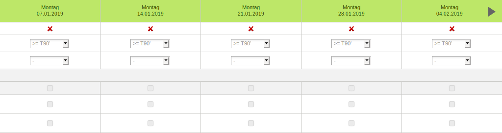

# SportDB Helper

Helferscript für die Anwesenheitskontrolle auf https://www.sportdb.ch.

## Problem

Das wöchentliche führen der Anwesenheitskontrolle ist äusserst mühsam:



## Lösung

SportDB Helper startet von einem Excelfile, dass die J+S-ID und die wöchentliche Anwesenheit
aller Teilnehmer enthält (als Referenz, siehe [./data/reference.xls](./data/reference.xls?raw=true)).

Aufgrund dieser Daten füllt SportDB Helper automatisch die Anwesenheitskontrolle aus ([Video in besserer Auflösung](images/in-action.mp4?raw=true)).


## Verwendung

### Installation

Die folgende Installationsanleitung ist für Ubuntu gedacht. Andere Systeme sollten analog verwendbar sein (nicht getestet, Anpassung braucht Erfahrung).

Um SportDB Helfer zu verwenden, brauchst du [docker](https://docs.docker.com/install/), `git` und `make`:

- Um `git` und `make` zu installieren:
```
# for git
sudo apt-get install git-all
# for make
sudo apt-get install build-essential

```

- Docker auf Ubuntu installieren: https://docs.docker.com/install/linux/docker-ce/ubuntu/.

- Herunterladen von SportDB Helper:

```bash
git clone git@github.com:bichselb/sportdb-helper.git
cd sportdb-helper
```

- Installation von SportDP Helper (fragt nach dem Passwort für die Interaktion mit docker):

```bash
make image
```

- (Optional) Cleanup nach Verwendung (fragt nach dem Passwort für die Interaktion mit docker):

```bash
make clean
```

### SportDB Helper

Um SportDB Helper laufen zu lassen (fragt nach dem Passwort für die Interaktion mit docker):

```bash
./run.sh --username "js-123456" --password "ABC" --course-id 1234567 ./data/attendance.xls
# NICHT VERGESSEN: Eingegebene Daten prüfen und Kurs manuell abschliessen
```

ACHTUNG: Die `course-id` ist nicht dasselbe wie die "Angebot"-Nummer. Die
`course-id` findest du, wenn du in der URL deines Kurses, z.B.:

- https://www.sportdb.ch/extranet/kurs/kursEdit.do?kursId=1234567&org.apache.struts.taglib.html.TOKEN=0000000000000000000000000

### Details

Für mehr Details zur Verwendung von SportDP Helper:

```bash
./run.sh --help
```
